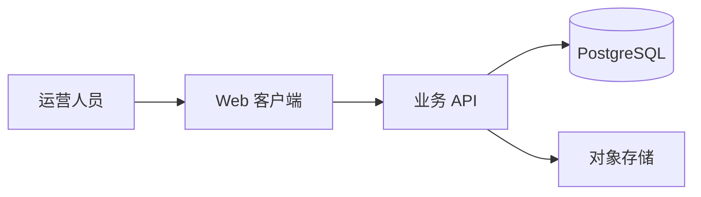

# 版本管理规范

## 硬约束

> 本节是 AI 必守清单，违反即错误；下文各节是背景、模板和细节，按需阅读。

- **MUST**：每次修改代码后同步更新版本号和 `CHANGELOG.md`
- **MUST**：版本号采用语义化格式，允许 rc 预发布标识（如 `1.2.3-rc2`）
- **MUST**：功能新增才提升正式版本位（MINOR/MAJOR），并把 rc 重置为 `rc1`；bugfix 只递增 rc 号（`-rc2` → `-rc3`），不得提升正式版本位（对外发布、须遵循标准 SemVer 的库/包除外，详见 `version-control.md` 语义化版本号一节）
- **MUST**：前端与后端版本号保持一致；服务端 API 通过响应 header（如 `X-App-Version`）暴露当前版本
- **MUST**：用户要求 git 提交时，打 `v{版本号}` tag 并随代码一起推送（远程是 GitHub 时推到 GitHub）
- **MUST**：新项目创建根目录 `.gitignore` 和 `ARCHITECTURE.md`；架构变更在同一改动中更新文档
- **MUST**：敏感文件（`.env`、密钥等）必须列入 `.gitignore`，不得提交
- **MUST NOT**：直接在 main/develop 上 commit；一律走 feature 分支 + PR
- **MUST NOT**：一个 PR 混 feat + fix + refactor
- **MUST NOT**：改了版本号不写 CHANGELOG，或 CHANGELOG 与代码不同步

## 分支策略

### 主分支
- **develop 优先**：如果仓库有 `develop` 分支，一切开发从 develop 拉出；没有就用 `main`
- **main 只接受合并**：main 上的代码必须是可发布的稳定版本，不直接在 main 上开发

### 开发流程
```
main ─────────────────────────────────────●──●── (release tag)
          \                              /
develop ───●──●──────────────────●──────●
              \                  /
feature/xxx ───●──●──●──────────
```

1. 从 develop（没有则 main）拉 feature 分支
2. 在 feature 分支开发 + 提交
3. 完成后提 PR 合回 develop
4. 准备发布时，develop → main，打 tag

### 分支命名
```
feature/<功能名>      # feature/user-auth, feature/payment
fix/<问题描述>        # fix/login-timeout, fix/typo
release/<版本号>      # release/v1.2.0
hotfix/<问题描述>     # hotfix/critical-bug
```

## 语义化版本号

格式：`MAJOR.MINOR.PATCH[-rcN]`（如 `1.4.2`、`1.5.0-rc3`）

### 默认约定（业务项目 / 内部项目）

开发期版本常态携带 `-rcN` 预发布标识，正式版本位只由功能变更驱动：

| 变更类型 | 版本号变化 | 示例 |
|---------|-----------|------|
| bugfix | 只递增 rc 号，不动正式版本位 | `1.5.0-rc2` → `1.5.0-rc3` |
| 新增功能（向后兼容） | 提升 MINOR，rc 重置为 rc1 | `1.5.0-rc3` → `1.6.0-rc1` |
| 破坏性变更 | 提升 MAJOR，rc 重置为 rc1 | `1.6.0-rc1` → `2.0.0-rc1` |
| 正式发布 | 去掉 rc 后缀并打 tag | `1.6.0-rc4` → `1.6.0` |

### 例外：标准 SemVer 项目

对外发布的开源库、公共 npm/Go module/PyPI 包，或团队已明确采用标准 SemVer 的项目，按标准语义处理：

| 变更类型 | 版本号 | 说明 |
|---------|--------|------|
| PATCH | 1.4.X → 1.4.X+1 | bug 修复，行为不变 |
| MINOR | 1.X → 1.X+1.0 | 新增功能，向后兼容 |
| MAJOR | X → X+1.0.0 | 破坏性变更，不兼容旧 API |

哪套都行，但一个项目只能用一套；项目现状与本规范不一致时，在 `AGENTS.md` / `CLAUDE.md` 里写明采用哪套。

### 版本号在哪改
- Go 项目：源码里声明 `var Version = "1.2.3"`（编译时 ldflags 注入也行）
- 前端项目：`package.json` 的 `version` 字段
- Python 项目：`pyproject.toml` / `__init__.py` 里的 `__version__`
- 多项目仓库：各子项目独立版本号，根目录 CHANGELOG 汇总

### 每次改动前先想
- 这是修 bug？→ 递增 rc 号（标准 SemVer 项目递增 PATCH）
- 加了新功能但 API 没变？→ MINOR
- 删了接口 / 改了字段类型 / 行为不兼容？→ MAJOR

### macOS/iOS 项目：Build 号同步

- 语义化版本写入 `CFBundleShortVersionString`（用户可见版本号）
- `CFBundleVersion` / `CURRENT_PROJECT_VERSION`（Build 号）每次发版 **+1**，从 1 开始递增，不重置
- 改版本号时必须同时改 Build 号，两者不能脱节
- 在哪改：`Info.plist` / `.xcconfig` / Xcode 项目设置 `CURRENT_PROJECT_VERSION`

## CHANGELOG.md

每次提交必须更新。按时间倒序，最新在最上面。

### 格式模板
```markdown
# Changelog

## [1.2.0] - 2026-05-27

### Added
- 用户注册接口 /api/auth/register
- 登录失败 5 次锁定 15 分钟

### Changed
- 密码哈希从 md5 改为 bcrypt

### Fixed
- 修复 token 过期后不自动刷新的问题

### Deprecated
- /api/v1/login 将于 v2.0 移除，请迁移到 /api/v2/auth

---

## [1.1.0] - 2026-05-20

### Added
- 仪表盘页面
```

### 分类标准
- **Added**：新增功能
- **Changed**：修改已有功能
- **Fixed**：Bug 修复
- **Removed**：删除功能
- **Deprecated**：即将删除，先标废弃
- **Security**：安全修复

### 规则
- 一个版本一个 `## [版本号]` 段落
- 没有对应内容的分段直接省略（别写 "None"）
- 每条用一句话说清改了什么，附上 PR 号更好

## PRODUCT_OVERVIEW.md

**这是项目的"当前状态说明书"**——不看代码也能知道项目是什么、有什么功能、怎么跑。

### 它回答什么，不回答什么

| 问题 | `PRODUCT_OVERVIEW.md` 的答案 |
|------|-------------------------------|
| 这是什么项目、给谁用、解决什么问题？ | 必须回答 |
| 现在能做什么、首版不做什么、有哪些已知限制？ | 必须回答 |
| 如何本地运行、部署和验证？ | 必须回答 |
| 每个模块内部怎么实现、表字段和函数如何调用？ | 不写，转到 `ARCHITECTURE.md`、API 文档或代码 |

把它当作产品交接页：新成员和 AI 先读它，应该能在几分钟内理解项目边界与当前状态。

### 格式模板
```markdown
# Product Overview

> 最后更新：2026-05-27 | 当前版本：v1.2.0

## 项目简介
一句话说清楚这个项目是干什么的。

## 核心功能
- 用户注册/登录（支持手机号 + 邮箱）
- 仪表盘数据概览
- 工单创建与流转
- ...

## 当前范围
- 本版本目标：让运营人员在一个工作台查看并处理工单。
- 暂不支持：移动端、第三方工单系统双向同步。

## 技术栈
- 后端：Go 1.23 + chi + sqlx + MySQL 8.0
- 前端：React 19 + TypeScript + Vite + Tailwind CSS
- 部署：Go embed 单文件，systemd 守护

## API 概览
| 方法 | 路径 | 说明 |
|------|------|------|
| POST | /api/auth/login | 用户登录 |
| GET | /api/users/me | 当前用户信息 |
| ... | ... | ... |

## 部署
- 编译：`make build`
- 运行：`./bin/server`
- 配置：环境变量 `APP_PORT` `DB_DSN`

## 文档入口
- 架构与技术决策：[ARCHITECTURE.md](ARCHITECTURE.md)
- API 契约：`docs/api.md`
- 部署手册：`docs/runbook.md`

## 已知问题 / 待办
- [ ] 密码重置流程未实现
- [ ] 大屏适配（移动端）
```

### 规则
- 每次发版后更新版本号和最后更新时间。
- 新增、删除或改变用户可见行为的功能时，同步更新“核心功能”“当前范围”“API 概览”和已知限制。
- 项目定位、目标用户、主要流程、运行方式或交付入口发生变化时，同步更新。
- 只重构内部代码且不改变产品能力、运行方式或已知限制时，通常不必更新；不要把实现日志塞进来。
- **这份文档给新人看的**——他应该能靠这个文档把项目跑起来

## ARCHITECTURE.md

**这是项目的“技术地图”**——让后来者能快速理解系统如何组成、数据如何流动，以及为何采用当前方案。

### 它回答什么，不回答什么

| 问题 | `ARCHITECTURE.md` 的答案 |
|------|---------------------------|
| 系统由哪些客户端、服务、数据库和外部系统组成？ | 必须回答 |
| 模块边界、依赖方向、请求/事件/数据如何流动？ | 必须回答 |
| 为什么选该技术、存储、通信或部署方案？ | 必须回答重要取舍 |
| 某个函数、组件或全部接口字段怎么写？ | 不写，转到代码、模块 README、OpenAPI 或 ADR |

把它当作技术交接页：读完后应能画出系统、判断改动会影响哪里，并知道关键方案不是“祖传玄学”。

### 规则
- **新项目必须创建**：开始正式实现前，项目根目录必须创建 `ARCHITECTURE.md`；已有仓库缺失时，应在首次涉及架构或模块改动前补齐。
- **架构变更必须同步更新**：技术栈、系统边界、模块拆分或合并、服务通信、数据存储、接口协议、认证授权、异步任务、部署拓扑、关键第三方集成等发生变化时，必须在同一改动中更新文档。
- **文档必须可追溯**：文件顶部记录最后更新日期和当前版本；重要取舍应链接到 ADR 或在文档中说明背景、决策和影响。
- **不要把普通实现细节都塞进去**：`ARCHITECTURE.md` 记录稳定的系统级设计；局部实现细节留在模块 README、代码注释或 ADR，避免文档长成技术墓志铭。

### 推荐模板
````markdown
# Architecture

> 最后更新：2026-05-27 | 当前版本：v1.2.0

## 架构概览
一句话说明系统形态与主要边界，例如“React Web 客户端通过 REST API 调用 Go 单体服务，服务使用 PostgreSQL 持久化数据，并接入对象存储处理附件”。

## 系统上下文
用 Mermaid 或文本图画出用户、客户端、服务、数据库、队列和第三方依赖；箭头标明 HTTP、事件或文件流。



## 模块与职责
| 模块 | 职责 | 依赖 / 通信方式 |
|------|------|-----------------|
| Web 客户端 | 展示工作台、提交操作 | HTTPS 调用业务 API |
| 业务 API | 认证、工单流程、审计 | SQL、对象存储 SDK |

## 数据与接口
- 关键数据：哪些数据存在哪里，哪些是敏感数据，谁可以访问。
- 关键流程：以“创建工单 → 处理 → 通知”为例，写清数据和事件流向。
- 契约：接口风格、事件主题、鉴权方式；完整字段定义链接到 OpenAPI 或专门 API 文档。

## 部署与运行
- 运行单元：进程、容器、服务或任务队列分别部署在哪里。
- 发布与配置：构建产物、环境变量、迁移执行顺序和回滚入口。
- 可靠性：健康检查、日志/指标、备份恢复、扩缩容或降级策略。

## 关键决策与演进
| 决策 | 原因 | 影响 / ADR |
|------|------|------------|
| 先采用模块化单体 | 团队小且业务仍在验证 | 服务边界稳定后再拆分；ADR-001 |

## 已知限制
- 当前文件上传由同步请求处理；超过 100 MB 时改为异步任务。
````

### 两份文档何时一起更新

| 变更 | Product Overview | Architecture |
|------|------------------|--------------|
| 新增用户可见功能或改变产品范围 | 必须更新 | 仅当影响系统设计时更新 |
| 更换数据库、框架、认证方式或部署拓扑 | 如运行方式/技术栈描述变化则更新 | 必须更新 |
| 新增服务、队列、第三方关键集成或跨服务事件 | 可选 | 必须更新 |
| 新增或修改一个 API 的字段 | 如公开 API 概览变化则更新 | 仅影响契约风格、边界或关键数据流时更新 |
| 单模块内部重构、改函数名、修 CSS | 通常不更新 | 通常不更新 |

## 提交流程

### 每次开发结束的标准动作
```bash
# 1. 改版本号
# 2. 更新 CHANGELOG.md
# 3. 更新 PRODUCT_OVERVIEW.md（如果有功能变化）
# 4. 更新 ARCHITECTURE.md（新项目创建，或架构发生变化时）

# 5. 提交
git add .
git commit -m "chore: bump version to v1.2.0

- Add user registration endpoint
- Fix token refresh bug"

# 5. 推送
git push origin feature/user-auth

# 6. 提 PR：feature/user-auth → develop

# 7. 合并后打 tag
git tag -a v1.2.0 -m "Release v1.2.0"
git push origin v1.2.0
```

### Commit Message 规范
```
type(scope): summary

详细说明（可选，可多行）
```

| type | 用途 |
|------|------|
| feat | 新功能 |
| fix | Bug 修复 |
| docs | 文档变更 |
| style | 格式（不影响代码逻辑） |
| refactor | 重构 |
| perf | 性能优化 |
| test | 测试 |
| chore | 构建/工具/版本号 |
| ci | CI/CD 变更 |

### 别做的事
- 别直接在 main/develop 上 commit
- 别一个 PR 混 feat + fix + refactor
- 别忘了 push tag（别人拉不到）
- 别改完版本号不写 changelog
- 别让 CHANGELOG 和代码不同步

## .gitignore

每个项目根目录必须有 `.gitignore`。以下是在各种项目中常见的忽略条目：

### 通用
```
.DS_Store
*.swp
*.swo
*~
.env
.env.local
*.log
.cache
```

### Node / 前端
```
node_modules/
dist/
build/
.next/
.nuxt/
.cache/
```

### Go
```
.local-cache/
vendor/（除非使用 vendor 模式）
```

### Python
```
__pycache__/
*.pyc
.venv/
venv/
.pytest_cache/
.mypy_cache/
.ruff_cache/
```

### macOS / iOS
```
DerivedData/
*.xcworkspace/xcuserdata/
Pods/
.build/
```

### 规则
- **能匹配目录的用 `/` 结尾**（如 `node_modules/`），避免误伤同名文件
- **优先用 `*` 模式**，别逐条写几百行
- **敏感文件必须列在 `.gitignore`**（`.env`、密钥文件等）
- **别临时 `git add -f` 忽略的文件**——除非真的有理由打破规则

## 完整 workflow 示例

```
想做一个用户头像上传功能：

1. git checkout develop && git pull
2. git checkout -b feature/avatar-upload
3. 开发...
4. 改版本号：v1.2.0 → v1.3.0（新功能，MINOR）
5. 更新 CHANGELOG.md
6. 更新 PRODUCT_OVERVIEW.md（接口、功能列表）
7. 如果影响服务边界、存储、接口或部署，更新 ARCHITECTURE.md
8. git commit -m "feat(avatar): add avatar upload endpoint"
9. git push origin feature/avatar-upload
10. PR: feature/avatar-upload → develop
11. 合并后 git tag v1.3.0 && git push --tags
```
